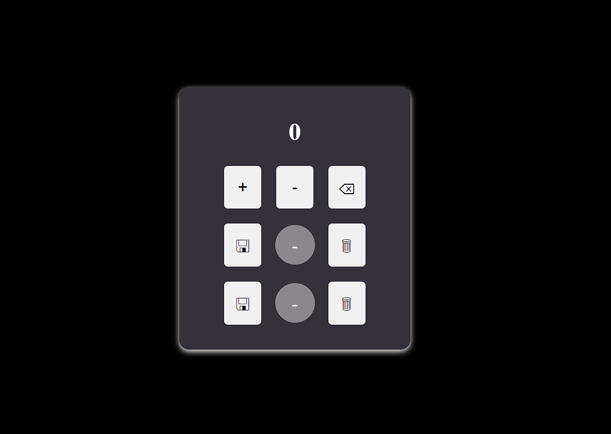

# **Project Counter**
## *📝 Descrizione del Progetto*
Questo progetto è un'applicazione web da utilizzare come un semplice counter, con opzioni di salvataggio per 2 count diversi.

## *💻 Tecnologie Utilizzate*
- HTML
- CSS
- JavaScript

## *🚀 Funzionalità*
- Incremento e decremento del counter
- Salvataggio di due valori di count diversi
- Reset dei valori

## *📸 Screenshot*

## *🌐 Link all'Applicazione*
[🔗 Vai all’applicazione](https://contatore-6467b.web.app/)

## *👤 Autore*
Mattia Cavaliere - [MatthewChevalier](https://github.com/MatthewChevalier)
